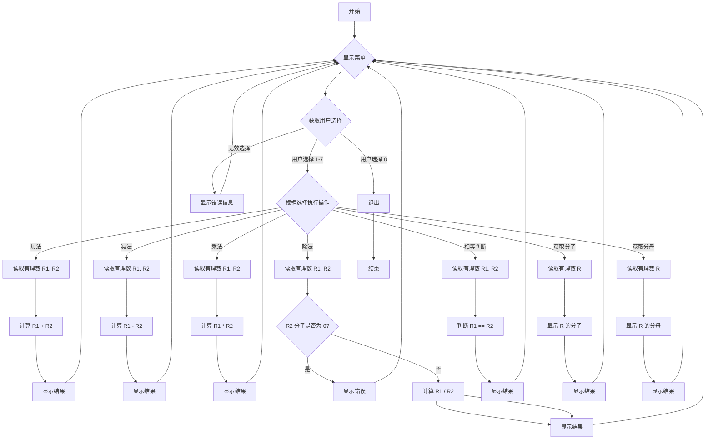

# 有理数的四则运算

**班级:** [请填写您的班级]
**姓名学号:** [请填写您的姓名及学号]
**完成日期:** 2026年1月10日

## 1. 问题描述和需求分析

### 输入形式及范围
有理数通过键盘输入，形式为 `n/m`，其中 `n` 为分子，`m` 为分母。分子和分母均为整数。
分子的范围：无特定限制，可为正、负或零。
分母的范围：非零整数。程序会进行分母为零的校验。

### 输出形式
有理数的输出形式为 `n/m`，其中 `n` 为分子，`m` 为分母。
所有结果均会进行自动约分，并保证分母为正数。例如，`2/4` 将输出 `1/2`；`-1/-2` 将输出 `1/2`。
运算结果若为整数，如 `2/1`，仍将以 `2/1` 形式输出。

### 程序功能描述
本程序旨在实现有理数的四则运算（加、减、乘、除）及其辅助功能。具体功能包括：
1.  **有理数定义:** 使用结构体（`struct Rational`）存储有理数的分子和分母。
2.  **构造函数:** 支持带参数构造，并在构造时进行分母为零的异常处理和自动约分。
3.  **基本运算:**
    *   **加法:** 实现两个有理数的相加。
    *   **减法:** 实现两个有理数的相减。
    *   **乘法:** 实现两个有理数的相乘。
    *   **除法:** 实现两个有理数的相除，包含除数为零（即除数分子为零）的异常处理。
4.  **辅助功能:**
    *   **判断相等:** 判断两个有理数是否相等（约分后比较）。
    *   **获取分子:** 返回有理数的分子。
    *   **获取分母:** 返回有理数的分母。
5.  **自动约分:** 内部实现最大公约数（GCD）算法，确保所有有理数在创建和运算后自动约分到最简形式，并规范分母为正。
6.  **异常处理:**
    *   输入有理数时，若分母为零，程序会提示错误并要求重新输入。
    *   进行除法运算时，若除数的分子为零，程序会提示错误。
7.  **交互界面:** 提供一个菜单驱动的用户界面，用户可以选择执行不同的运算，并支持循环操作直到用户选择退出。

### 测试数据
以下测试数据覆盖了程序的各项功能及异常处理：

1.  **加法测试:**
    *   `1/2 + 1/3` -> `5/6`
    *   `1/2 + (-1/2)` -> `0/1`
    *   `1/3 + 2/3` -> `1/1`
2.  **减法测试:**
    *   `1/2 - 1/3` -> `1/6`
    *   `1/2 - 1/2` -> `0/1`
    *   `1/3 - 2/3` -> `-1/3`
3.  **乘法测试:**
    *   `1/2 * 1/3` -> `1/6`
    *   `2/3 * 3/4` -> `1/2`
    *   `1/2 * 0/5` -> `0/1`
4.  **除法测试:**
    *   `1/2 / 1/3` -> `3/2`
    *   `2/3 / 4/5` -> `5/6`
    *   `1/2 / 0/3` -> 错误: "Division by zero (numerator of divisor is zero)."
5.  **相等判断测试:**
    *   `1/2 == 2/4` -> `TRUE`
    *   `1/2 == 1/3` -> `FALSE`
6.  **获取分子/分母测试:**
    *   输入 `1/2` -> 分子: `1`, 分母: `2`
    *   输入 `2/4` (内部约分后为 `1/2`) -> 分子: `1`, 分母: `2`
7.  **输入分母为零的异常处理:**
    *   输入 `1/0` -> 错误: "Denominator cannot be zero." (并提示重新输入)

## 2. 概要设计

### 定义抽象数据类型（ADT）
**ADT Rational**
*   **数据元素:** 由两个整数组成：分子（numerator）和分母（denominator）。
*   **数据关系:** 分子和分母共同表示一个有理数，两者之间通过除法关系连接。
*   **基本操作:** 
    *   `Rational(int num, int den)`: 构造函数，创建有理数，并进行分母为零检查和约分。
    *   `simplify()`: 将有理数约分至最简形式，并确保分母为正。
    *   `operator+(const Rational& other)`: 加法运算。
    *   `operator-(const Rational& other)`: 减法运算。
    *   `operator*(const Rational& other)`: 乘法运算。
    *   `operator/(const Rational& other)`: 除法运算，包含除数分子为零检查。
    *   `operator==(const Rational& other)`: 相等判断。
    *   `getNumerator()`: 获取分子。
    *   `getDenominator()`: 获取分母。
    *   `readRational()`: 从标准输入读取有理数。
    *   `displayRational(const Rational& r)`: 向标准输出显示有理数。
    *   `calculateGCD(int a, int b)`: 计算两个整数的最大公约数（内部辅助函数）。

### 主程序流程图描述



### 模块调用关系

```mermaid
graph TD
    A[main] --> B{readRational};
    A --> C{displayRational};
    A --> D{Rational::operator+};
    A --> E{Rational::operator-};
    A --> F{Rational::operator*};
    A --> G{Rational::operator/};
    A --> H{Rational::operator==};
    A --> I{Rational::getNumerator};
    A --> J{Rational::getDenominator};

    B --> K{Rational::Rational(int, int)};
    D --> K;
    E --> K;
    F --> K;
    G --> K;
    K --> L{Rational::simplify};
    L --> M{Rational::calculateGCD};
```

## 3. 详细设计

### 实现数据类型的伪代码或核心算法说明

#### 1. `struct Rational` 结构体
```cpp
struct Rational {
    int numerator;    // 分子
    int denominator;  // 分母

    // 构造函数
    Rational(int num, int den) {
        if (den == 0) {
            throw std::invalid_argument("Denominator cannot be zero."); // 异常处理
        }
        numerator = num;
        denominator = den;
        simplify(); // 构造时自动约分
    }

    // calculateGCD 函数 (见下方GCD算法说明)
    int calculateGCD(int a, int b) { ... }

    // simplify 函数 (见下方约分算法说明)
    void simplify() { ... }

    // 重载运算符 (见下方四则运算算法说明)
    Rational operator+(const Rational& other) const { ... }
    Rational operator-(const Rational& other) const { ... }
    Rational operator*(const Rational& other) const { ... }
    Rational operator/(const Rational& other) const { ... }
    bool operator==(const Rational& other) const { ... }

    // 获取分子、分母
    int getNumerator() const { return numerator; }
    int getDenominator() const { return denominator; }
};
```

#### 2. 最大公约数 (GCD) 算法 (`calculateGCD`)
采用欧几里得算法（辗转相除法）。C++17 标准库提供了 `std::gcd`，本实现直接使用以提高效率和简洁性。如果不支持C++17，则需要手动实现：
```cpp
int calculateGCD(int a, int b) {
    // 确保a, b为正数进行GCD计算
    // std::gcd 接受非负数，并返回非负数结果
    return std::abs(std::gcd(a, b));
    /*
    // 手动实现欧几里得算法:
    a = std::abs(a);
    b = std::abs(b);
    while (b != 0) {
        int temp = b;
        b = a % b;
        a = temp;
    }
    return a;
    */
}
```

#### 3. 有理数约分算法 (`simplify`)
1.  如果分子为零，则将分母设为1（如 `0/5` 约分为 `0/1`）。
2.  计算分子和分母的最大公约数 `common_divisor`。
3.  分子和分母分别除以 `common_divisor`。
4.  如果分母为负，则将分子和分母同时取反，确保分母始终为正（如 `1/-2` 约分为 `-1/2`）。
```cpp
void simplify() {
    if (numerator == 0) {
        denominator = 1;
        return;
    }
    int common_divisor = calculateGCD(numerator, denominator);
    numerator /= common_divisor;
    denominator /= common_divisor;

    if (denominator < 0) {
        numerator = -numerator;
        denominator = -denominator;
    }
}
```

#### 4. 四则运算算法

*   **加法 (`operator+`)**: 
    两个有理数 `n1/d1` 和 `n2/d2` 相加：
    ` (n1*d2 + n2*d1) / (d1*d2) `
    结果通过构造函数自动约分。

*   **减法 (`operator-`)**: 
    两个有理数 `n1/d1` 和 `n2/d2` 相减：
    ` (n1*d2 - n2*d1) / (d1*d2) `
    结果通过构造函数自动约分。

*   **乘法 (`operator*`)**: 
    两个有理数 `n1/d1` 和 `n2/d2` 相乘：
    ` (n1*n2) / (d1*d2) `
    结果通过构造函数自动约分。

*   **除法 (`operator/`)**: 
    两个有理数 `n1/d1` 和 `n2/d2` 相除：
    即 `n1/d1 * d2/n2`
    首先检查除数 `n2` 是否为零。如果为零，抛出 `std::invalid_argument` 异常。
    否则，结果为 ` (n1*d2) / (d1*n2) `
    结果通过构造函数自动约分。

*   **相等判断 (`operator==`)**: 
    由于有理数在构造时已自动约分并规范分母为正，因此直接比较约分后的分子和分母即可。
    ` (this->numerator == other.numerator) && (this->denominator == other.denominator) `

## 4. 调试分析

### 遇到的问题及解决方法

1.  **分母为0的处理:** 
    *   **问题:** 用户在输入有理数时，可能将分母输入为0，这将导致数学上的无意义和程序运行时除以零的错误。
    *   **解决方法:** 在 `Rational` 结构体的构造函数中添加校验。如果传入的分母为0，则抛出 `std::invalid_argument` 异常。在 `readRational` 函数中捕获此异常，并提示用户重新输入，直至输入合法。

2.  **除法运算中除数为0（分子为0）的处理:** 
    *   **问题:** 在进行除法运算时，如果除数的分子为0（例如 `1/2 / 0/3`），则构成除以零。
    *   **解决方法:** 在 `operator/` 重载函数中，检查 `other.numerator` 是否为0。如果为0，则抛出 `std::invalid_argument` 异常，并在 `main` 函数的 `switch` 语句中捕获并输出错误信息。

3.  **负数约分问题及分母规范化:** 
    *   **问题:** 约分后有理数可能出现 `-1/-2` 或 `1/-2` 这样的形式，不符合常见的数学表示习惯（通常分母为正，负号置于分子或整个分数前）。
    *   **解决方法:** 在 `simplify` 函数中添加逻辑。如果约分后分母 `denominator` 为负数，则将分子 `numerator` 和分母 `denominator` 同时取反，以确保分母始终为正。例如，`1/-2` 变为 `-1/2`，`-1/-2` 变为 `1/2`。

4.  **输入流错误处理:** 
    *   **问题:** 用户可能输入非数字字符或错误格式（如 `1 2` 而非 `1/2`），导致 `std::cin` 进入错误状态，后续输入无法正常进行。
    *   **解决方法:** 在 `readRational` 函数中，每次读取输入后检查 `std::cin.fail()`。如果失败，调用 `std::cin.clear()` 清除错误状态，并使用 `std::cin.ignore()` 忽略当前行剩余的无效输入，然后提示用户重新输入。`main` 函数中对菜单选择的输入也做了类似处理。

### 算法时空复杂度分析

1.  **GCD 算法 (`calculateGCD`)**: 
    *   **时间复杂度:** 欧几里得算法的时间复杂度为 O(log(min(a, b)))，其中 `a` 和 `b` 是两个输入整数。这是一个非常高效的算法。
    *   **空间复杂度:** O(1)，因为它是迭代实现，只使用了常数额外的空间。

2.  **有理数四则运算 (`operator+`, `operator-`, `operator*`, `operator/`)**: 
    *   **时间复杂度:** 每个运算都涉及常数次整数的乘法、加法（或减法）和除法，并调用一次 `simplify()` 函数。因此，主要复杂度取决于 `simplify()` 中的 GCD 算法，为 O(log D)，其中 D 是相关分母的乘积（因为会涉及到求公分母或乘积分母）。
    *   **空间复杂度:** O(1)，每个操作都创建了一个新的 `Rational` 对象作为结果，只使用了常数额外的空间。

3.  **约分算法 (`simplify`)**: 
    *   **时间复杂度:** 主要由 `calculateGCD` 决定，为 O(log(min(numerator, denominator)))。
    *   **空间复杂度:** O(1)。

**总结:** 核心算法（GCD）具有对数时间复杂度，因此整个有理数运算系统的效率非常高，即使处理较大的分子和分母，也能保持快速响应。

### 经验和体会

通过本次课程设计，我对C++中结构体的应用、运算符重载、异常处理和算法设计有了更深入的理解。
1.  **ADT设计的重要性:** 将有理数抽象为一个ADT，并通过封装数据（分子、分母）和操作（四则运算、约分），使得代码结构清晰、易于维护和扩展。
2.  **运算符重载的便利性:** 通过重载 `+`, `-`, `*`, `/`, `==` 等运算符，使得有理数运算可以像基本数据类型一样直观和简洁，提高了代码的可读性。
3.  **异常处理的健壮性:** 学习并实践了如何使用 `try-catch` 机制处理运行时错误（如分母为零、除数为零），这使得程序在面对非法输入或运算时能够优雅地处理，而不是崩溃。这是编写健壮程序不可或缺的一部分。
4.  **算法优化:** 深入理解了欧几里得GCD算法的原理和效率，并通过其实现有理数的自动约分，确保了结果的规范性和正确性。同时，考虑了负数约分的细节处理，使程序更加完善。
5.  **用户交互设计:** 菜单驱动的界面设计提升了程序的用户友好性，让用户能够清晰地选择所需操作并进行多次运算。
总的来说，这是一个将理论知识与实际编程相结合的良好实践，提升了解决实际问题的能力和代码的工程化水平。

## 5. 用户使用说明

本程序提供一个命令行交互界面，用于执行有理数的四则运算和相关查询。

### 启动程序
编译并运行 `Rational.cpp` 文件。例如，使用 g++ 编译器：
```bash
g++ Rational.cpp -o Rational -std=c++17
./Rational
```
（确保您的编译器支持 C++17 以使用 `std::gcd`，否则可能需要手动实现 GCD。）

### 菜单选项
程序启动后，会显示以下操作菜单：

```
--- Rational Number Calculator ---
1. Addition (+)
2. Subtraction (-)
3. Multiplication (*)
4. Division (/)
5. Check Equality (==)
6. Get Numerator of a Rational Number
7. Get Denominator of a Rational Number
8. Exit
Enter your choice:
```

### 操作步骤

1.  **选择操作:** 在 `Enter your choice:` 提示后，输入对应操作的数字（0-7），然后按回车键。
2.  **输入有理数:** 
    *   对于需要两个有理数的操作（加、减、乘、除、相等判断），程序会分别提示您输入第一个和第二个有理数。
    *   对于需要一个有理数的操作（获取分子、获取分母），程序会提示您输入一个有理数。
    *   输入格式示例: `1/2`。分子和分母之间使用 `/` 分隔。
3.  **查看结果:** 程序会立即显示运算结果或查询结果。
4.  **循环操作:** 完成当前操作后，程序会再次显示菜单，您可以继续选择其他操作。
5.  **退出程序:** 输入 `0` 并按回车键即可退出程序。

### 异常处理示例

*   **输入分母为零:** 
    ```
    Enter a rational number (e.g., 1/2): 1/0
    Error: Denominator cannot be zero. Please try again.
    Enter a rational number (e.g., 1/2):
    ```
    程序会提示错误并要求重新输入合法有理数。

*   **除数为零:** 
    ```
    Enter first rational number:
    Enter a rational number (e.g., 1/2): 1/2
    Enter second rational number:
    Enter a rational number (e.g., 1/2): 0/3
    Error: Division by zero (numerator of divisor is zero).
    ```
    程序会显示除法错误信息。

*   **无效输入:** 
    ```
    Enter your choice: abc
    Invalid input. Please enter a number.
    ```
    ```
    Enter a rational number (e.g., 1/2): 1 2
    Invalid input format. Please enter in 'n/m' format.
    ```
    程序会提示输入错误，并要求重新输入。

## 6. 附录：源程序代码

```cpp
#include <iostream>
#include <numeric> // For std::gcd in C++17, if available. Otherwise, implement manually.
#include <string>
#include <limits> // For numeric_limits

// Struct to represent a rational number
struct Rational {
    int numerator;
    int denominator;

    // Default constructor
    Rational() : numerator(0), denominator(1) {}

    // Parameterized constructor
    Rational(int num, int den) {
        if (den == 0) {
            throw std::invalid_argument("Denominator cannot be zero.");
        }
        numerator = num;
        denominator = den;
        simplify(); // Simplify on construction
    }

    // Function to calculate GCD
    int calculateGCD(int a, int b) {
        return std::abs(std::gcd(a, b));
    }

    // Function to simplify the rational number
    void simplify() {
        if (numerator == 0) {
            denominator = 1; // 0/x simplifies to 0/1
            return;
        }
        int common_divisor = calculateGCD(numerator, denominator);
        numerator /= common_divisor;
        denominator /= common_divisor;

        // Ensure denominator is positive
        if (denominator < 0) {
            numerator = -numerator;
            denominator = -denominator;
        }
    }

    // Overload + operator for addition
    Rational operator+(const Rational& other) const {
        int common_denominator = this->denominator * other.denominator;
        int new_numerator = (this->numerator * other.denominator) + (other.numerator * this->denominator);
        return Rational(new_numerator, common_denominator);
    }

    // Overload - operator for subtraction
    Rational operator-(const Rational& other) const {
        int common_denominator = this->denominator * other.denominator;
        int new_numerator = (this->numerator * other.denominator) - (other.numerator * this->denominator);
        return Rational(new_numerator, common_denominator);
    }

    // Overload * operator for multiplication
    Rational operator*(const Rational& other) const {
        int new_numerator = this->numerator * other.numerator;
        int new_denominator = this->denominator * other.denominator;
        return Rational(new_numerator, new_denominator);
    }

    // Overload / operator for division
    Rational operator/(const Rational& other) const {
        if (other.numerator == 0) {
            throw std::invalid_argument("Division by zero (numerator of divisor is zero).");
        }
        int new_numerator = this->numerator * other.denominator;
        int new_denominator = this->denominator * other.numerator;
        return Rational(new_numerator, new_denominator);
    }

    // Overload == operator for equality check
    bool operator==(const Rational& other) const {
        return (this->numerator == other.numerator) && (this->denominator == other.denominator);
    }

    // Get numerator
    int getNumerator() const {
        return numerator;
    }

    // Get denominator
    int getDenominator() const {
        return denominator;
    }
};

// Function to read a rational number from user input
Rational readRational() {
    int num, den;
    char slash;
    while (true) {
        std::cout << "Enter a rational number (e.g., 1/2): ";
        std::cin >> num >> slash >> den;
        if (std::cin.fail() || slash != '/') {
            std::cout << "Invalid input format. Please enter in 'n/m' format.\n";
            std::cin.clear();
            std::cin.ignore(std::numeric_limits<std::streamsize>::max(), '\n');
            continue;
        }
        try {
            return Rational(num, den);
        } catch (const std::invalid_argument& e) {
            std::cout << "Error: " << e.what() << " Please try again.\n";
            std::cin.clear();
            std::cin.ignore(std::numeric_limits<std::streamsize>::max(), '\n');
        }
    }
}

// Function to display a rational number
void displayRational(const Rational& r) {
    std::cout << r.getNumerator() << "/" << r.getDenominator();
}

// Main function to run the rational number calculator
int main() {
    int choice;
    Rational r1, r2, result;

    do {
        std::cout << "\n--- Rational Number Calculator ---\n";
        std::cout << "1. Addition (+)\n";
        std::cout << "2. Subtraction (-)\n";
        std::cout << "3. Multiplication (*)\n";
        std::cout << "4. Division (/)\n";
        std::cout << "5. Check Equality (==)\n";
        std::cout << "6. Get Numerator of a Rational Number\n";
        std::cout << "7. Get Denominator of a Rational Number\n";
        std::cout << "0. Exit\n";
        std::cout << "Enter your choice: ";
        std::cin >> choice;

        if (std::cin.fail()) {
            std::cout << "Invalid input. Please enter a number.\n";
            std::cin.clear();
            std::cin.ignore(std::numeric_limits<std::streamsize>::max(), '\n');
            continue;
        }

        switch (choice) {
            case 1: // Addition
                std::cout << "Enter first rational number:\n";
                r1 = readRational();
                std::cout << "Enter second rational number:\n";
                r2 = readRational();
                result = r1 + r2;
                displayRational(r1);
                std::cout << " + ";
                displayRational(r2);
                std::cout << " = ";
                displayRational(result);
                std::cout << "\n";
                break;
            case 2: // Subtraction
                std::cout << "Enter first rational number:\n";
                r1 = readRational();
                std::cout << "Enter second rational number:\n";
                r2 = readRational();
                result = r1 - r2;
                displayRational(r1);
                std::cout << " - ";
                displayRational(r2);
                std::cout << " = ";
                displayRational(result);
                std::cout << "\n";
                break;
            case 3: // Multiplication
                std::cout << "Enter first rational number:\n";
                r1 = readRational();
                std::cout << "Enter second rational number:\n";
                r2 = readRational();
                result = r1 * r2;
                displayRational(r1);
                std::cout << " * ";
                displayRational(r2);
                std::cout << " = ";
                displayRational(result);
                std::cout << "\n";
                break;
            case 4: // Division
                std::cout << "Enter first rational number:\n";
                r1 = readRational();
                std::cout << "Enter second rational number:\n";
                r2 = readRational();
                try {
                    result = r1 / r2;
                    displayRational(r1);
                    std::cout << " / ";
                    displayRational(r2);
                    std::cout << " = ";
                    displayRational(result);
                    std::cout << "\n";
                } catch (const std::invalid_argument& e) {
                    std::cout << "Error: " << e.what() << "\n";
                }
                break;
            case 5: // Check Equality
                std::cout << "Enter first rational number:\n";
                r1 = readRational();
                std::cout << "Enter second rational number:\n";
                r2 = readRational();
                displayRational(r1);
                std::cout << " == ";
                displayRational(r2);
                if (r1 == r2) {
                    std::cout << " is TRUE\n";
                } else {
                    std::cout << " is FALSE\n";
                }
                break;
            case 6: // Get Numerator
                std::cout << "Enter a rational number:\n";
                r1 = readRational();
                std::cout << "Numerator of ";
                displayRational(r1);
                std::cout << " is: " << r1.getNumerator() << "\n";
                break;
            case 7: // Get Denominator
                std::cout << "Enter a rational number:\n";
                r1 = readRational();
                std::cout << "Denominator of ";
                displayRational(r1);
                std::cout << " is: " << r1.getDenominator() << "\n";
                break;
            case 0:
                std::cout << "Exiting program. Goodbye!\n";
                break;
            default:
                std::cout << "Invalid choice. Please try again.\n";
                break;
        }
    } while (choice != 0);

    return 0;
}
```